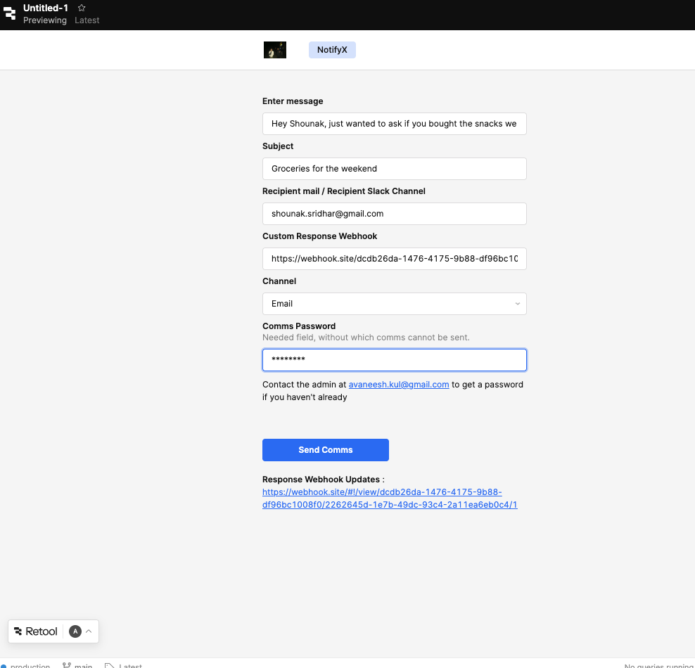

# NotifyX - An Event-Driven Notification Platform 

## Overview
This project is a multi-service notification platform built using an event-driven architecture. I've connected the engine to a Retool Front end for the purpose of demonstration

## Retool Access Point : 
https://avaneeshdomain.retool.com/apps/f5f62a44-22f3-11f1-8605-cbaf803d5c1b/Untitled-1/page1

## Retool View :



## NOTE
For the latest version of the following repositories , please clone the repositories independently from the following links, this repository only serves purpose to show structuring of the project : 

# notification-api 
https://github.com/avankode/notification-api

# notification-worker
https://github.com/avankode/notification-worker


## Architecture
- API Service → receives requests
- RabbitMQ → message broker
- Worker Service → processes notifications

## Services
- notification-api
- notification-worker

## Tech Stack
- Spring Boot
- RabbitMQ
- Redis (rate limiting and deduplication)

## Run Locally

```bash
docker-compose up --build
```

After running this command , you should be able to run the ```notification-api``` and ```notification-worker``` services.
